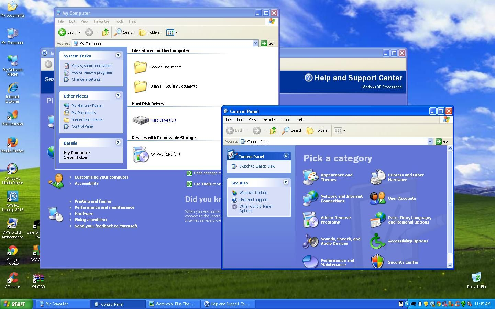
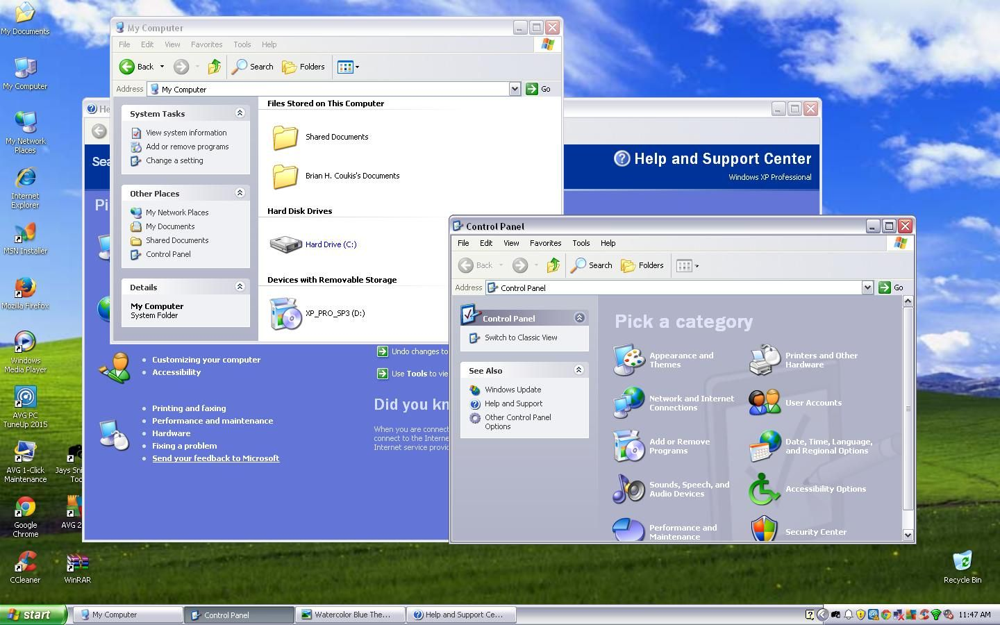
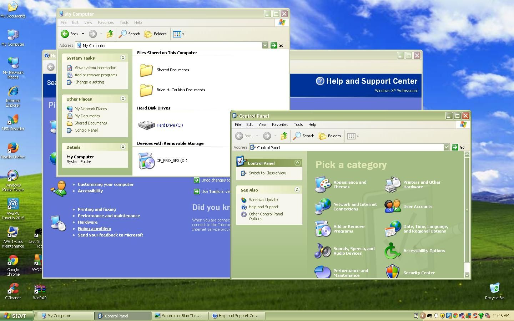
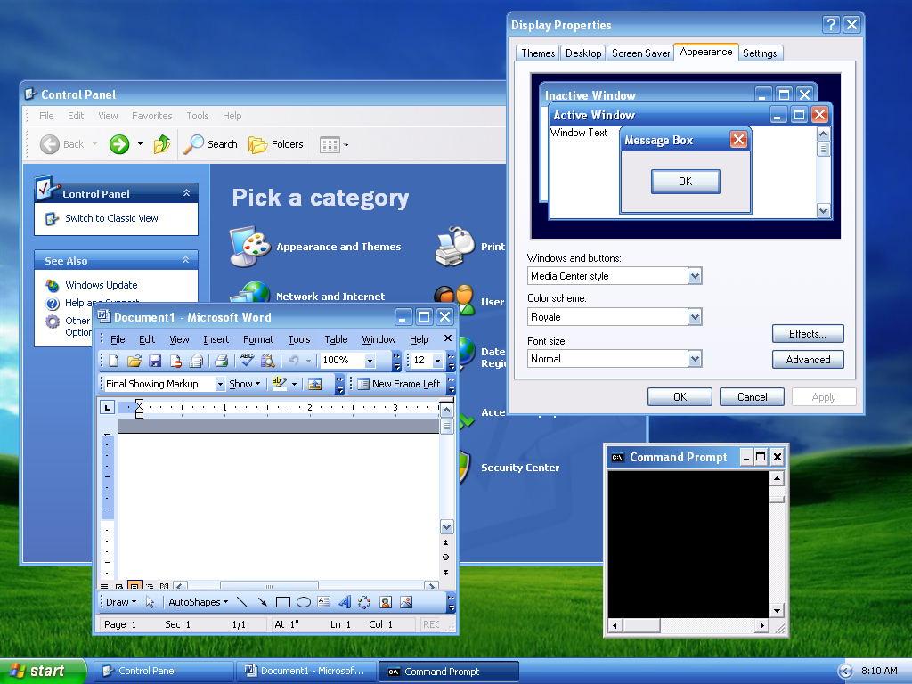
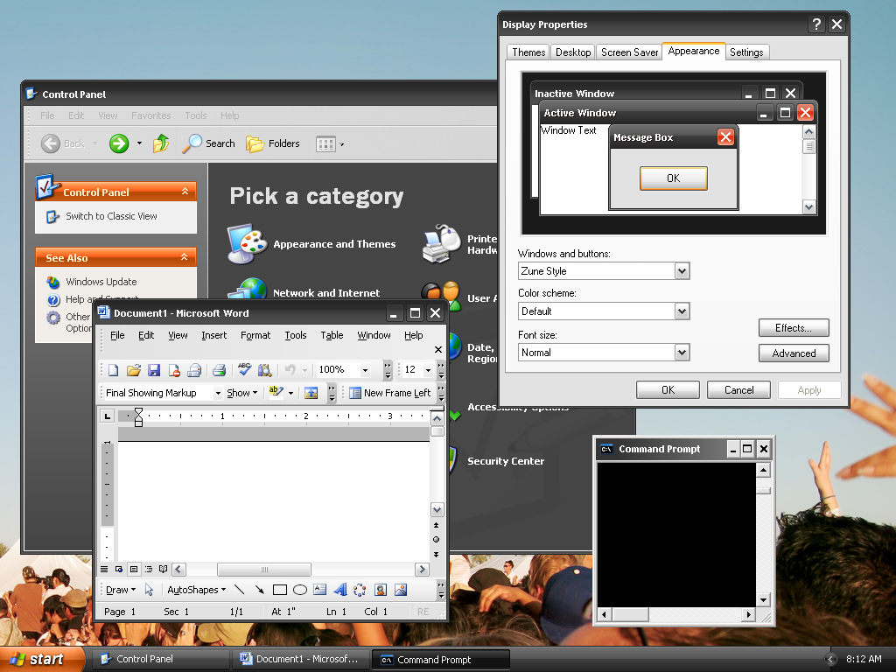
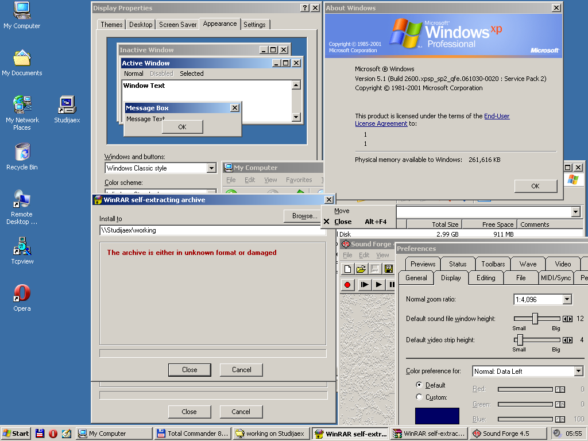

# wine_themes
 
A collection of original and restyled .msstyles themes for [wine](https://www.winehq.org/).
 

## Description

Selected bunch of windows .msstyles themes gathered from allover the Internet and some of them tweaked a little bit by using .reg files. Tested and verified to be perfectly working in [wine](https://www.winehq.org/):

* [**Windows XP Style Theme**](https://en.wikipedia.org/wiki/Windows_XP_visual_styles#Luna) (*__color schemes__: Blue, Silver, Olive Green*)
* [**Windows XP Royale Theme**](https://en.wikipedia.org/wiki/Windows_XP_visual_styles#Royale)
* [**Windows XP Zune Theme**](https://en.wikipedia.org/wiki/Windows_XP_visual_styles#Zune)
* [**Windows Classic Theme**](https://en.wikipedia.org/wiki/Windows_XP_visual_styles#Windows_Classic)
* **Lunainspaqua Theme** (*__color schemes__: Normal, Compact, Compact2*)
* **Ambient Theme** (*__color schemes__: Default, Compact, Classic, CLasic Compact*)
* **Human Theme** (*__color schemes__: Orange, Blue, Graphite, Green, Purple, Orange Compact, Blue Compact, Grahite Compact, Green Compact, Purple Compact*)
* **Capriccio Theme**
* **Light Theme** (*included in wine >= 8.0*)

<p float="left">
	<a href="./images/win_xp_blue_theme.jpg"></a>
	<a href="./images/win_xp_silver_theme.jpg"></a>
	<a href="./images/win_xp_olive_green_theme.jpg"></a>
</p>
<p float="left">
	<a href="./images/win_xp_royale_theme.png"></a>
	<a href="./images/win_xp_zune_theme.png"></a>
	<a href="./images/win_classic_theme.png"></a>
</p>


## Getting Started

### Dependencies

* [Wine package](https://wiki.winehq.org/Download) installed
* A viable [wineprefix](https://wiki.winehq.org/FAQ#Wineprefixes)

### Installing

* Download latest [release](https://github.com/listumps/wine_themes/releases/latest)
* Considering your WINEPREFIX is the default one (~/.wine) then just unzip all files and folders into ~/.wine/drive_c/windows/resources/themes

### Applying a restyled/tweaked theme

* Considering your WINEPREFIX is the default one (~/.wine) then just run in console:
```bash
regedit /C ~/.wine/drive_c/windows/resources/themes/reg/apply_{name}_theme.reg
```
where *apply_{name}_theme.reg* is one of the .reg files supplied in the [release](https://github.com/listumps/wine_themes/releases/latest).

### Applying an original theme

You can always apply any of the original themes listed in the [description](#description) by means of running [winecfg](https://wiki.winehq.org/Winecfg) GUI configuration tool and going to 'Desktop Integration' tab.


## Acknowledgments

* [www.skin-soft.co.uk](https://www.skin-soft.co.uk/visualstyles/skingallery.aspx)
* [wine-themes](https://github.com/winunix/wine-themes)

